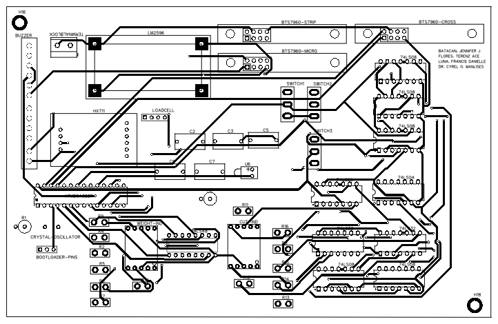
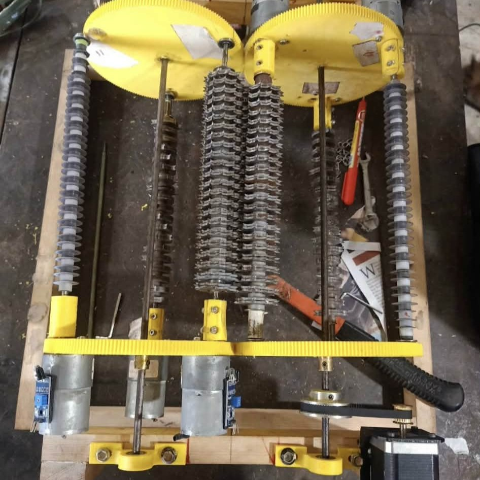
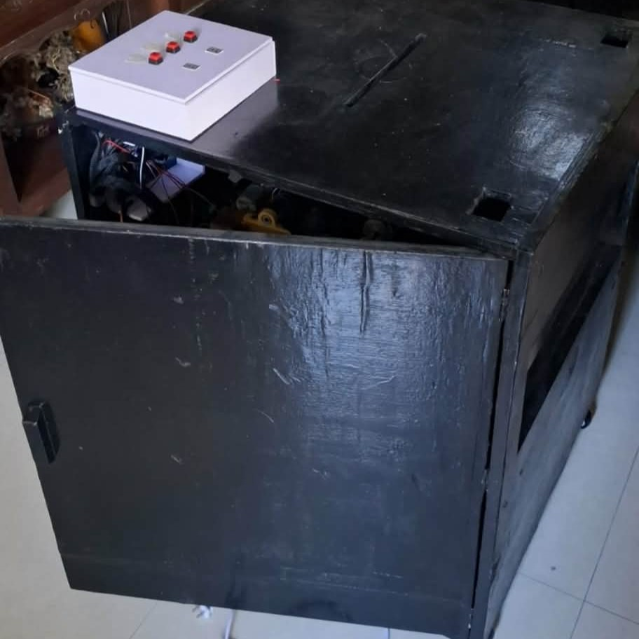
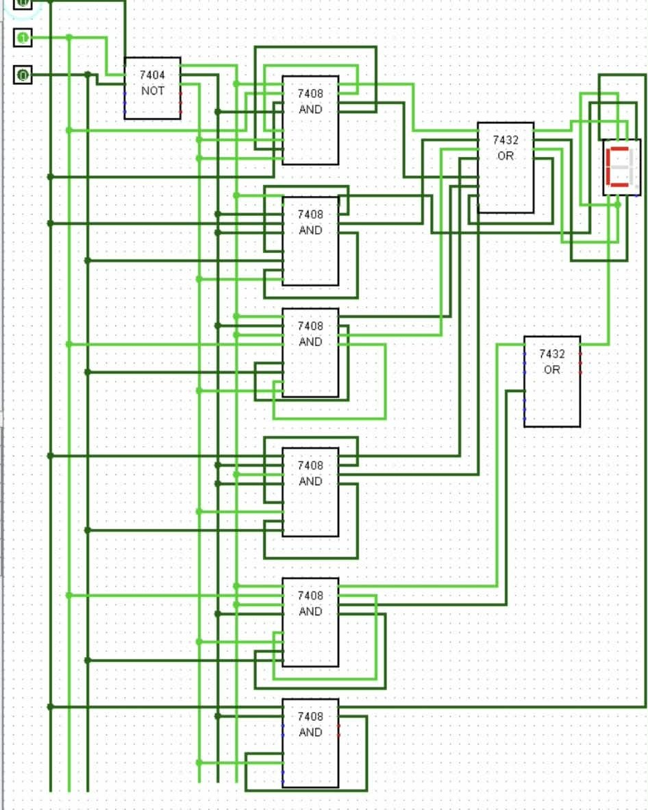
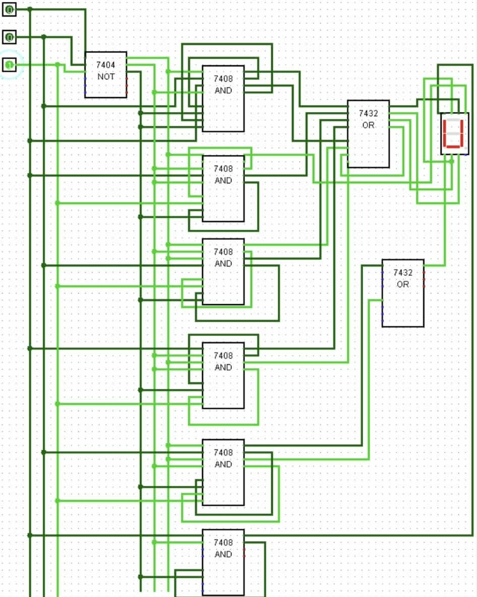
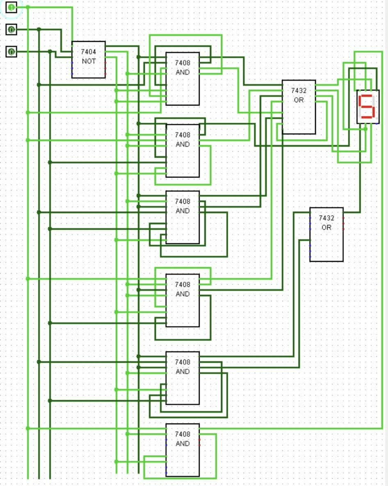
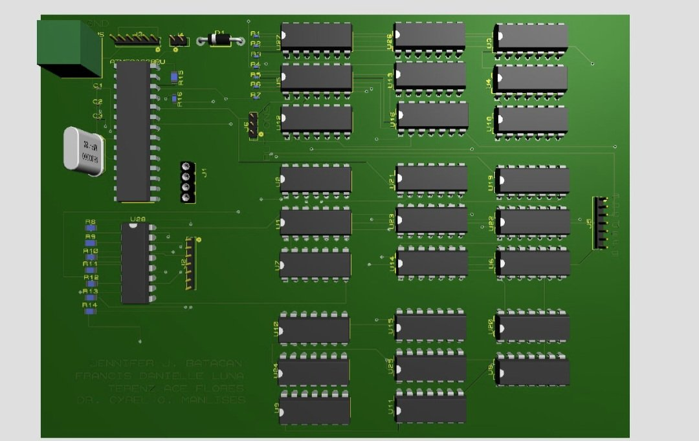

# 3-blades-paper-shredder

This project implemented a paper shredder system utilizing three pairs of blades, with a custom-designed printed circuit board (PCB) for control and operation, demonstrating my ability in Embedded Systems. 

## 🚀 Features
- Three pairs of high-efficiency blades
- PCB-based control and automation
- Safety voltage execution integration
- Compact motor driver circuitry

## ⚡ System Overview
1. **Motor Control:** The PCB drives the shredder motor.
2. **Blade Mechanism:** Three pairs of blades operate in synchronized motion.
3. **Safety Circuit:** Automatically stops on jam detection.

| Component | Description |
|------------|-------------|
| Motor | 12V DC Motor |
| Blades | 3 pairs, stainless steel |
| PCB | Custom designed using EasyEDA & Proteus |

## 💡 PCB Schematic Diagram

## PCB Layout and Prototyping

<table>
<tr>
<td></td>
<td></td>
<td></td>
<td></td>
</tr>
</table>

## PCB Combinational Circuit Simulation

<table>
  <tr>
    <td></td>
    <td></td>
    <td></td>
    <td></td>
  </tr>
</table>

