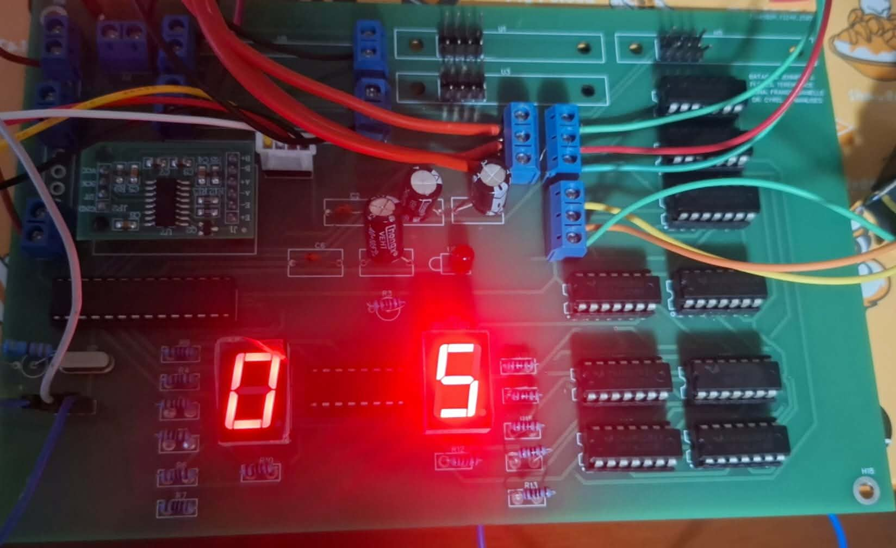
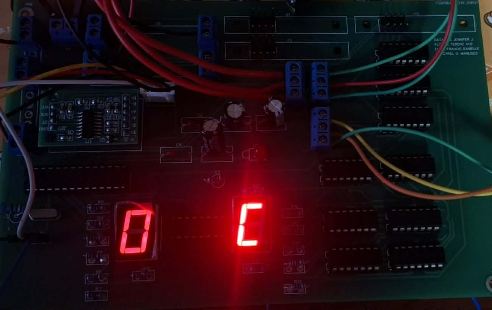
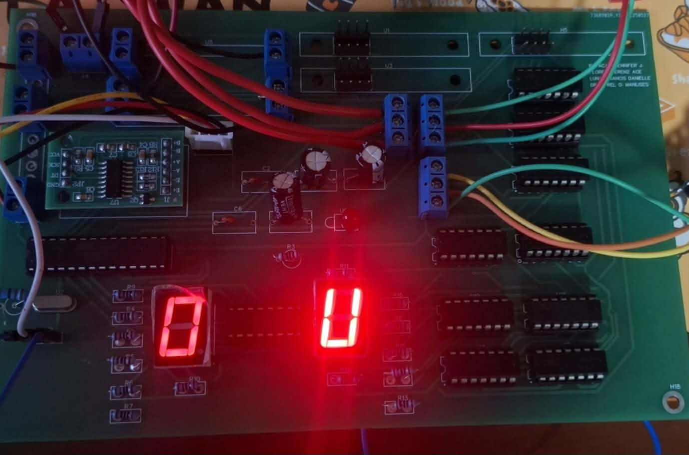
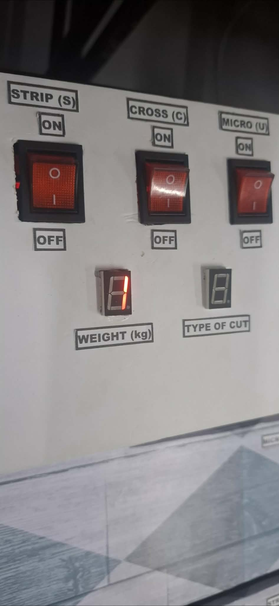

# 3-blades-paper-shredder

This project implemented a paper shredder system utilizing three pairs of blades, with a custom-designed printed circuit board (PCB) for control and operation, demonstrating my ability in Embedded Systems. 

## 🚀 Features
- Three pairs of high-efficiency blades
- PCB-based control and automation
- Safety voltage execution integration
- Compact motor driver circuitry

## ⚡ System Overview
1. **Motor Control:** The PCB drives the shredder motor.
2. **Blade Mechanism:** Three pairs of blades operate in synchronized motion.
3. **Safety Circuit:** Automatically stops on jam detection.

| Component | Description |
|------------|-------------|
| Motor | 12V DC Motor |
| Blades | 3 pairs, stainless steel |
| PCB | Custom designed using EasyEDA & Proteus |

## 💡 PCB Schematic Diagram

## 📐 PCB Layout and Prototyping

<table>
<tr>
<td></td>
<td></td>
<td></td>
<td></td>
</tr>
</table>

## 💻⚙️ PCB Combinational Circuit Simulation

<table>
  <tr>
    <td></td>
    <td></td>
    <td></td>
    <td></td>
  </tr>
</table>

## 🧾 User Manual 
1. **Plug-in Device:** Switch on the external power button to supply power to the prototype. 
2. **System Initialization Check:** Confirm that the seven-segment display and other system indicators are working properly. The display should show "0" upon successful initialization.
3. **Select a Cutting Mode:** Once the system has initialized, select the preferred cutting mode by pressing the
corresponding switch.  

***Strip-Cut Mode***
<ul>
<li>   Press the first switch to activate the strip cut 
mode.  </li>
<li>    Verify functionality by observing the motor 
operation. Once the motors are active, insert 
a sheet of paper into the strip cut feeder and 
wait for the shredding process to complete.  </li>
<li>    After testing, ensure the switch is turned off 
before selecting the next shredding mode.   </li>
</ul>

***Cross-Cut Mode***
<ul>
<li>   Press the second switch to activate the cross-cut 
mode.  </li>
<li>    Verify functionality by observing the motor 
operation. Once the motors are active, insert 
a sheet of paper into the strip cut feeder and 
wait for the shredding process to complete.  </li>
<li>    After testing, ensure the switch is turned off 
before selecting the next shredding mode.   </li>
</ul>

***Micro-Cut Mode***
<ul>
<li>   Press the third switch to activate the micro-cut 
mode.  </li>
<li>    Verify functionality by observing the motor 
operation. Once the motors are active, insert 
a sheet of paper into the strip cut feeder and 
wait for the shredding process to complete.  </li>
<li>    After testing, ensure the switch is turned off 
before selecting the next shredding mode.   </li>
</ul>

Request Final Video Demo through this link: https://drive.google.com/file/d/1gla7fulxsFyBamaDr72acsCUVDNbXXHi/view?usp=sharing 

4. **Weight Detection Test:**
<ul>
<li>   Place a 3kg weight on the load cell plate.  </li>
<li>   Verify that the buzzer activates, 
indicating the container has reached the 
threshold weight.  </li>
</ul>

